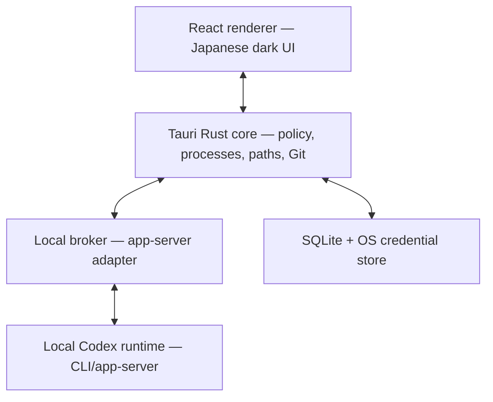

# Architecture

## Recommendation

Use **Tauri 2 + React/TypeScript + Rust**, with a small local **Codex app-server integration broker**. Rust owns policy enforcement, process lifecycle, filesystem/Git access, persistent metadata, and Tauri IPC. The broker owns only app-server JSON-RPC translation and streaming.

This keeps React away from tokens, shell, filesystem, and upstream protocol details. SDK/app-server changes stay in one adapter.

## System composition



The broker uses private process transport (stdio or OS-private endpoint), never a LAN/public listener. Tauri launches, authenticates, and terminates it.

## Codex integration contract

The official app-server is the interface Codex uses for rich clients, including authentication, conversation history, approvals, and streamed events. It is the primary interactive integration over private stdio JSONL. The TypeScript SDK and codex exec --json remain separate options for automation/diagnostics, not the primary interactive engine.

CodexAdapter exposes startSession, resumeSession, sendTurn, requestStop, and respondToApproval. It emits versioned normalized events: message_delta, message_final, tool_started, tool_finished, approval_requested, status_changed, file_changed, log, error. Unknown upstream events are redacted diagnostics, never executable instructions.

## State and data model

SQLite stores non-secret state only.

| Entity                 | Purpose                                 | Secret policy   |
| ---------------------- | --------------------------------------- | --------------- |
| projects               | canonical root, name, commands, policy  | none            |
| sessions               | external thread ID, state, title, times | no credentials  |
| turns                  | message metadata/content references     | redact secrets  |
| tabs                   | order, pinning, restore flags           | none            |
| layouts                | panel sizes/visibility/presets          | none            |
| approvals/audit_events | redacted decisions                      | no raw secrets  |
| terminal_runs          | provenance, cwd, duration, exit         | redacted output |
| prompt_templates       | project instructions                    | no secrets      |

Credentials stay in Codex local auth. Any future app-owned secret uses OS credential storage via Rust and never reaches React.

## Interfaces and directory plan

- React → Rust: typed intent commands only.
- Rust → React: typed sanitized events with sequence numbers.
- Rust → broker: private request/stream protocol with a per-launch capability held only by native processes.
- Rust → Git/filesystem: canonical project-root confinement and argument vectors, never UI-built shell strings.

```text
src/                       React UI and Zustand stores
src-tauri/src/             Rust commands, policy, process, Git, storage
src-tauri/capabilities/    minimal Tauri capabilities
crates/codex-broker/       broker launcher/protocol or Node sidecar
packages/protocol/         versioned schemas
tests/                     Vitest, Playwright, fixtures
```

## Errors and recovery

Classify errors as validation, policy denial, recoverable integration failure, process failure, Git/file failure, or internal failure. Show actionable Japanese summaries and bounded redacted diagnostics. Never retry commands automatically. Restart restores inactive snapshots only; it never resumes work.
